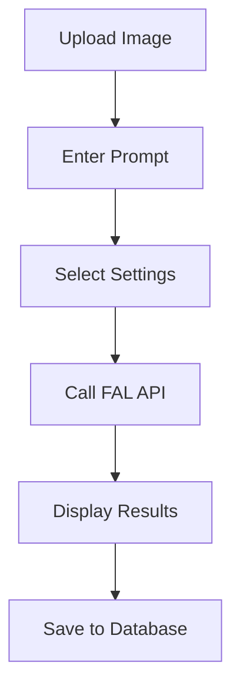

# ✏️ Edit Travel Tool

> **Status**: ⚠️ Hidden (Not Active) | **Path**: `/tools/edit-travel`

*Text-guided image transformations on a single image*

---

## 📁 File Structure

```
src/tools/edit-travel/
├── pages/
│   └── EditTravelToolPage.tsx    # Main UI
├── components/
│   └── EditTravelForm.tsx        # Settings form
└── settings.ts                   # Tool configuration
```

---

## 🔧 Components Overview

### `EditTravelToolPage.tsx`
**Main UI for image editing**
- Accepts input image, prompt, and aspect ratio
- Uses `PromptEditorModal` for text editing
- Triggers FAL API (`fal-ai/flux-pro/kontext`)
- Displays results in `ImageGallery`
- Saves edits to `generations` table

### `EditTravelForm.tsx`
**Configuration form**
- Input file selection
- Text prompt editing
- Generation mode options
- Aspect ratio selection
- Other transformation settings

---

## ⚠️ Current Status

This tool is **hidden from the Tool Selector** by default. To enable:

1. Add to environment config
2. Update tool manifest visibility
3. Test FAL API integration

---

## 🔄 Transformation Workflow



---

<div align="center">

**🔗 Navigation**

[Active Tools](../structure.md#-tool-modules) • [Add New Tool](./adding_new_tool.md) • [Back to Structure](../structure.md)

</div> 