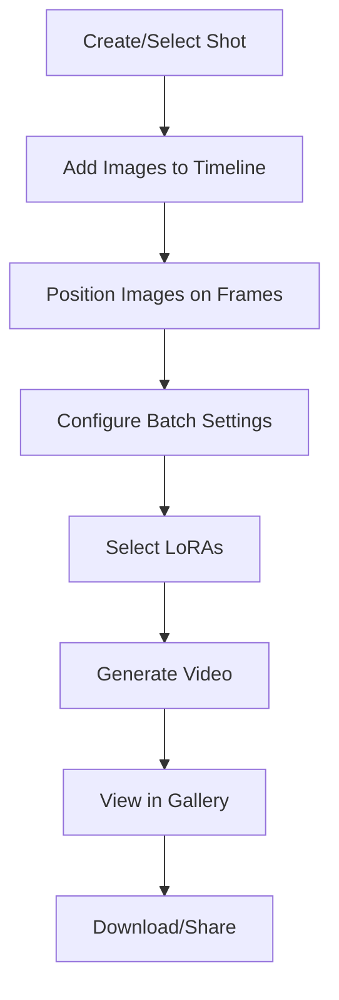

# 🎬 Video Travel Tool

> **Status**: ✅ Active | **Path**: `/tools/travel-between-images`

*Frame-accurate video generation with timeline-based shot editing*

---

## 📁 File Structure

```
src/tools/travel-between-images/
├── pages/
│   └── VideoTravelToolPage.tsx        # Main tool UI
├── components/
│   ├── ShotEditor.tsx                 # Core editing environment
│   ├── Timeline/                      # Frame-accurate timeline (refactored)
│   │   ├── index.tsx                  # Main Timeline component
│   │   ├── TimelineItem.tsx           # Individual timeline items
│   │   ├── TimelineControls.tsx       # Zoom & context controls
│   │   ├── TimelineRuler.tsx          # Frame ruler display
│   │   ├── DropIndicator.tsx          # File drop visual feedback
│   │   ├── PairRegion.tsx             # Video pair visualization
│   │   ├── GuidanceVideoUploader.tsx  # Structure video upload UI
│   │   ├── GuidanceVideoStrip.tsx     # Structure video display with hover scrubbing
│   │   ├── hooks/
│   │   │   ├── useFileDrop.ts         # File drag/drop logic
│   │   │   ├── useFramePositions.ts   # Frame position management
│   │   │   ├── useTimelineDrag.ts     # Timeline drag interactions
│   │   │   └── useZoom.ts             # Zoom & pan functionality
│   │   └── utils/
│   │       └── timeline-utils.ts      # Timeline calculations
│   ├── BatchSettingsForm.tsx          # Video generation settings
│   ├── MotionControl.tsx              # Main motion settings component (tabs: Basic/Presets/Advanced)
│   ├── PresetsSelector.tsx            # Phase config preset browser and loader
│   ├── PhaseConfigVertical.tsx        # Advanced phase configuration (vertical layout)
│   ├── VideoOutputsGallery.tsx        # Generated video display
│   ├── SimpleVideoPlayer.tsx          # Lightweight player
│   ├── TaskDetailsModal.tsx           # Generation parameters
│   ├── VideoShotDisplay.tsx           # Shot preview card
│   ├── ShotListDisplay.tsx            # Shot grid view with drag-and-drop reordering
│   ├── SortableShotItem.tsx           # Draggable shot card wrapper
│   └── SortableImageItem.tsx          # Draggable images
└── settings.ts                        # Tool configuration
```

---

## 🔧 Key Components

### `VideoTravelToolPage.tsx`
**Main tool interface**
- Lists project shots with `ShotListDisplay`
- Creates new shots via Supabase
- Hosts the main `ShotEditor`
- Manages LoRA state filtering for "Wan 2.1 14b" models
- Handles shot selection and navigation

### `ShotListDisplay.tsx` & `SortableShotItem.tsx`
**Shot reordering system with progressive loading**
- **Drag-and-Drop Interface**: Shots can be reordered by dragging the grip handle (⋮⋮)
- **Integrated Button Design**: Grip handle appears as the first action button, styled consistently
- **Database Integration**: Auto-saves new order using position field with `useReorderShots` hook
- **Optimistic Updates**: Immediate visual feedback with no jumping, reverts only on error
- **Visual Feedback**: Dragged items become semi-transparent, disabling during save operations
- **Touch Support**: Configured for mobile with delay/tolerance for drag activation
- **Error Handling**: Toast notifications for failed reorder operations

**Progressive Loading Performance**
- **Priority Batching**: First 3 shots load immediately, then batches of 3 every 500ms
- **Browser Cache Detection**: `checkIfImageCached()` detects images already loaded in ShotsPane
- **Smart Loading**: Cached images appear instantly, bypassing priority queue
- **Loading States**: Skeleton animations with spinning indicators during image loading
- **Staggered Animations**: Images reveal with 0.1s delays for smooth visual progression

### `ShotEditor.tsx`
**Core editing environment**
- Positions `VideoOutputsGallery` above for visibility
- Orchestrates all editing components
- Includes LoRA selector with strength controls
- Validates OpenAI API key when *Enhance Prompt* enabled
- Offers "Crop to project size" helper
- Manages shot state and updates

### `Timeline/` (Modular Timeline System)
**Frame-accurate timeline component (refactored into modular architecture)**
- **Main Component** (`index.tsx`):
  - Orchestrates all timeline functionality
  - Integrates drag/drop, zoom, and positioning logic
  - Manages frame validation and constraints
- **Sub-Components**:
  - `TimelineItem.tsx`: Individual draggable image items with visual feedback
  - `TimelineControls.tsx`: Context frames slider & zoom controls
  - `TimelineRuler.tsx`: Frame number ruler display
  - `DropIndicator.tsx`: Visual feedback for file drop targeting
  - `PairRegion.tsx`: Video pair visualization with context frames
- **Custom Hooks**:
  - `useFileDrop.ts`: File drag/drop validation and positioning
  - `useFramePositions.ts`: Frame position state management
  - `useTimelineDrag.ts`: Complex drag interactions with modifier key support
  - `useZoom.ts`: Zoom and pan functionality
- **Utilities**: `timeline-utils.ts` for frame calculations and constraints
- **Features**:
  - Drag-and-drop image positioning with modifier key support (⌘/⌥)
  - External image file dropping with frame-specific positioning
  - Gap validation between frames with visual feedback
  - Zoomable ruler overlay with pan support
  - `MediaLightbox` preview on click
  - Persistent position storage
- **File Support**: JPEG, PNG, WebP images via drag and drop
- **Drop Targeting**: Visual indicator shows exact frame position during drag
- **Precision**: Frame-level accuracy for video timing

### `BatchSettingsForm.tsx`
**Video generation settings**
- **Inputs**:
  - Batch prompts
  - Frame count & duration
  - Generation parameters (model, seed, turbo mode)

### `MotionControl.tsx`
**Unified motion settings component with three modes**
- **Tabbed Interface**: Basic, Presets, and Advanced modes
- **Basic Mode**: Shows "Amount of Motion" slider + active LoRAs display
- **Presets Mode**: Browse and load saved phase configuration presets
- **Advanced Mode**: Full phase configuration with Global Settings + per-phase controls
- **Conditional Rendering**: Adapts UI based on selected mode and turbo mode state
- **Props Integration**: Receives and passes motion-related props from ShotEditor

### `PresetsSelector.tsx`
**Phase configuration preset browser**
- **Preset Loading**: Browse and load saved phase configurations from database
- **Empty State**: Shows message when no preset selected
- **Preset Info Card**: Displays name, description, phase count, and video preview when preset is active
- **Edit Action**: Button to switch to Advanced mode for manual editing
- **Modal Integration**: Opens `PhaseConfigSelectorModal` for preset selection

### `PhaseConfigVertical.tsx`
**Advanced phase configuration editor (vertical layout)**
- **Two-Column Layout**: 
  - Global Settings split between left (phases, solver) and right (flow shift, random seed)
  - Phase cards split 1/3 (steps, guidance) and 2/3 (LoRAs)
- **Action Buttons**: Load Preset (icon-only), Save As Preset, Restore Defaults
- **Corner Labels**: Absolute-positioned title boxes in top-left corner
- **Phase Management**: Configure 2-3 phases with per-phase steps, guidance scale, and LoRAs
- **LoRA Integration**: Search and utility dropdowns for quick LoRA selection
- **Preset Integration**: Can load/save configurations as reusable presets
- **Features**:
  - *Enhance prompt* checkbox (requires OpenAI)
  - Mutually-exclusive LoRA toggles
  - Settings validation

### `VideoOutputsGallery.tsx`
**Generated video display**
- 3-column responsive grid
- Pagination for large collections
- Lightbox preview on click
- Download & delete actions
- Real-time update integration

### `SimpleVideoPlayer.tsx`
**Video playback controls**
- Speed options: -2×, -1×, 1×, 2×
- Lightweight player implementation
- Replaces hover-scrub in lightbox
- Frame-by-frame navigation

### `TaskDetailsModal.tsx`
**Generation parameter viewer**
- Shows complete generation settings
- *Use These Settings* button
- Applies parameters to `BatchSettingsForm`
- Deduplicates prompts automatically
- Expands array parameters

---

## 🔄 Video Generation Workflow



---

## ⚙️ Settings Schema

```typescript
{
  id: 'travel-between-images',
  scope: ['project', 'shot'],
  defaults: {
    framesPerVideo: 30,
    fps: 10,
    enhancePrompt: false,
    selectedLoRAs: [],
    batchSize: 1,
    interpolationSteps: 4
  }
}
```

---

## 🎯 Timeline Features

### Image Positioning
- Drag images to specific frames
- Automatic gap detection
- Visual feedback for invalid positions
- Snap-to-frame functionality

### Zoom & Navigation
- Mouse wheel zoom
- Pan with drag
- Frame ruler with labels
- Current position indicator

---

## 💡 Pro Tips

1. **Frame Spacing**: Leave 3-5 frames between images for smooth transitions
2. **LoRA Selection**: Use causvid for motion, LightI2X for style
3. **Prompt Enhancement**: Enable for more creative variations
4. **Batch Size**: Start with 1-2 videos to test settings

---

## Implementation Details

### Navigation & State Management

The Video Travel tool uses a universal navigation pattern via `useShotNavigation()`:

```typescript
const { navigateToShot, navigateToNextShot, navigateToPreviousShot } = useShotNavigation();

// Previous/Next buttons in ShotEditor
const handleNextShot = () => {
  if (shots && selectedShot) {
    navigateToNextShot(shots, selectedShot);
  }
};
```

**URL Hash Synchronization**: The tool maintains shot selection via URL hash (`#shotId`) with automatic synchronization between:
- URL changes (browser back/forward, direct links)
- Programmatic navigation (Previous/Next buttons)
- Shot selection from other components (ShotsPane, ShotGroup)

### Scalability Optimizations

**Client-Side Batch Fetching**: Handles projects with 1000+ generations by fetching `shot_generations` in batches:
```typescript
// useListShots implements batching for large datasets
const BATCH_SIZE = 1000;
while (hasMore) {
  const batch = await supabase
    .from('shot_generations')
    .select('*, generation:generations(*)')
    .range(offset, offset + BATCH_SIZE - 1);
  // Concatenate and continue...
}
```

**Database Optimizations**:
- `count_unpositioned_generations()` SQL function for efficient counts
- Performance indexes on `shot_id`, `position`, and `created_at`
- Client-side sorting instead of database ordering for flexibility

**Optimistic Updates**: ShotEditor uses optimistic state updates with conflict resolution to prevent UI flickering during reordering and editing operations.

---

## 🎥 Structure Video (ControlNet)

> **Status**: ✅ Implemented | **Added**: 2025-10

The timeline supports uploading a **structure video** (also called guidance video) to control motion during generation. This feature enables precise control over camera movement and object motion by providing a reference video that guides the generation process.

### Components

**GuidanceVideoUploader** (`Timeline/GuidanceVideoUploader.tsx`)
- Upload interface with file validation (MP4, WebM, MOV, max 200MB)
- Treatment mode selector: `adjust` (stretch/compress) or `clip` (use frames in range)
- Motion strength slider: 0.0 (no motion) to 2.0 (amplified), default 1.0
- Uses `videoUploader.ts` utility (follows `imageUploader.ts` pattern)

**GuidanceVideoStrip** (`Timeline/GuidanceVideoStrip.tsx`)
- Displays video above timeline with canvas-based rendering
- Hover-to-scrub functionality for frame-accurate preview
- Real-time frame mapping based on treatment mode
- Visual indicators for playback speed and motion strength

### Treatment Modes

**Adjust Mode** (Default)
- Time-stretches video to match timeline duration
- Slows down or speeds up playback to align with timeline frames
- Server handles actual frame interpolation during generation
- Client-side display is visual-only, no image deletion

**Clip Mode**
- Direct 1:1 frame mapping between timeline and video
- Shows frames in range, clips overflow or indicates gaps
- Useful when video duration matches timeline exactly

### Task Integration

Structure video parameters are added to `TravelBetweenImagesTaskParams`:
```typescript
{
  structure_video_path?: string | null;              // S3/Storage URL
  structure_video_treatment?: 'adjust' | 'clip';     // Frame mismatch handling
  structure_video_motion_strength?: number;          // 0.0-2.0, motion influence
}
```

**Storage**: Videos uploaded to `image_uploads` bucket at path `guidance-videos/{projectId}/{timestamp}-{random}.{ext}`

**State Management**: Per-shot state in `ShotEditor`, passed down through `ShotImagesEditor` → `Timeline` → `TimelineContainer` → `TimelineControls` and `GuidanceVideoStrip`

**Video Metadata Extraction**: Uses HTML5 Video API to extract duration, estimated frame rate (30fps default), dimensions, and file size

### Implementation Notes

- Structure video state resets when switching shots (not persisted across navigation)
- Metadata extraction happens client-side before upload
- Frame calculation uses `TIMELINE_HORIZONTAL_PADDING` constant for accurate positioning
- Canvas rendering optimizes hover scrubbing performance
- Seek debouncing prevents excessive video seek operations

---

<div align="center">

**🔗 Related Documentation**

[Back to Structure](../structure.md)

</div> 