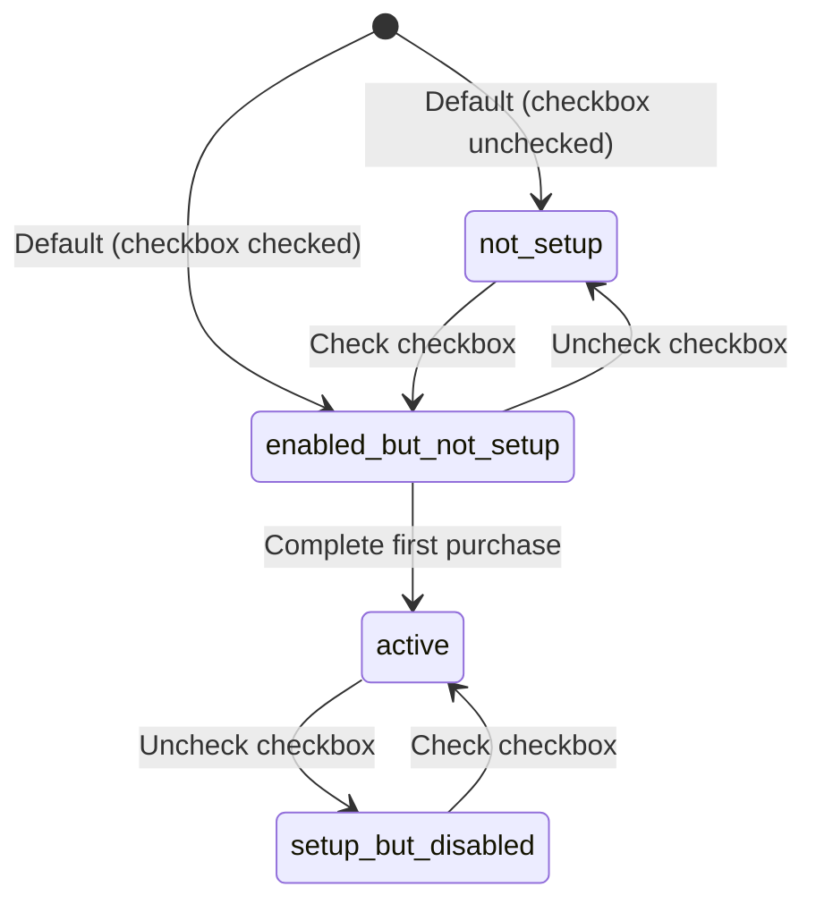

# Auto-Top-Up System

> **Overview**: Comprehensive credit purchase and automatic top-up system with Stripe integration, database triggers, and real-time UI updates.

## Table of Contents

- [1. System Overview](#1-system-overview)
- [2. Architecture Components](#2-architecture-components)
- [3. Database Schema](#3-database-schema)
- [4. UI Components & States](#4-ui-components--states)
- [5. Edge Functions](#5-edge-functions)
- [6. User Experience Flow](#6-user-experience-flow)
- [7. Implementation Details](#7-implementation-details)
- [8. Troubleshooting](#8-troubleshooting)

---

## 1. System Overview

The auto-top-up system provides seamless credit management with both manual purchases and automatic top-ups when credits run low. It integrates Stripe for payments, database triggers for monitoring, and real-time UI updates.

### Key Features

- ✅ **One-time credit purchases** - Manual credit additions via Stripe Checkout
- ✅ **Auto-top-up setup** - Save payment method during first purchase for future automation
- ✅ **Real-time monitoring** - Database triggers detect low credit balances
- ✅ **Automatic charging** - Off-session payments when balance drops below threshold
- ✅ **Smart UI states** - Context-aware messaging based on setup and enabled status
- ✅ **Mobile responsive** - Optimized for all screen sizes
- ✅ **Error handling** - Graceful failure modes and user notifications

---

## 2. Architecture Components

### Frontend Components
```
src/shared/components/CreditsManagement.tsx    # Main UI component
src/shared/hooks/useCredits.ts                # Credit balance & purchase logic
src/shared/hooks/useAutoTopup.ts              # Auto-top-up preferences management
```

### Backend Services
```
supabase/functions/stripe-checkout/           # Initial payment & setup
supabase/functions/stripe-webhook/            # Stripe event handling
supabase/functions/setup-auto-topup/          # Preference updates
supabase/functions/process-auto-topup/        # Automatic charging
supabase/functions/trigger-auto-topup/        # Background trigger handler
```

### Database Components
```sql
-- Core tables
users                    # User profiles with auto-top-up preferences
credits_ledger          # Credit transaction history

-- Triggers & Functions
check_auto_topup_trigger()    # Monitors credit balance changes
auto_topup_trigger           # Fires on credit updates
```

---

## 3. Database Schema

### Users Table Extensions

```sql
-- Auto-top-up preferences
ALTER TABLE users ADD COLUMN auto_topup_enabled boolean NOT NULL DEFAULT false;
ALTER TABLE users ADD COLUMN auto_topup_setup_completed boolean NOT NULL DEFAULT false;
ALTER TABLE users ADD COLUMN auto_topup_amount integer; -- in cents
ALTER TABLE users ADD COLUMN auto_topup_threshold integer; -- in cents
ALTER TABLE users ADD COLUMN auto_topup_last_triggered timestamptz;

-- Stripe integration
ALTER TABLE users ADD COLUMN stripe_customer_id text;
ALTER TABLE users ADD COLUMN stripe_payment_method_id text;
```

### State Definitions

| Field | Purpose | Example |
|-------|---------|---------|
| `auto_topup_enabled` | User preference toggle | `true`/`false` |
| `auto_topup_setup_completed` | Stripe payment method saved | `true`/`false` |
| `auto_topup_amount` | Top-up amount in cents | `5000` ($50) |
| `auto_topup_threshold` | Trigger balance in cents | `1000` ($10) |
| `stripe_customer_id` | Stripe customer reference | `cus_...` |
| `stripe_payment_method_id` | Saved payment method | `pm_...` |

### Credit Ledger Types

```sql
-- Extended enum for auto-top-up transactions
ALTER TYPE credit_ledger_type ADD VALUE 'auto_topup';
```

---

## 4. UI Components & States

### Main Component: CreditsManagement

Located in `src/shared/components/CreditsManagement.tsx`, this component handles the complete credit purchase and auto-top-up interface.

#### Auto-Top-Up UI States

The system displays different messages and controls based on user's setup and preference state:

| State | Condition | UI Color | Message | Button Text |
|-------|-----------|----------|---------|-------------|
| **🔵 enabled-but-not-setup** | ✅ Enabled + ❌ Not setup | Blue | "You've enabled auto-top-up, but it's not set up..." | "Add $50 and set-up auto-top-up" |
| **🟢 active** | ✅ Enabled + ✅ Setup complete | Green | "You've enabled and activated auto-top-up..." | "Add $50" |
| **🟡 setup-but-disabled** | ❌ Disabled + ✅ Setup complete | Yellow | "You have auto-top-up set up but it's currently deactivated..." | "Add $50" |
| **⚪ not-setup** | ❌ Disabled + ❌ Not setup | Gray | "Auto-top-up summary: We'll automatically charge..." | "Add $50" |
| **🚫 hidden** | ❌ Disabled (any setup state) | - | No summary displayed | "Add $50" |

#### Key UI Features

- **Default enabled**: Checkbox starts checked for new users (opt-out vs opt-in)
- **Dynamic threshold**: Auto-calculates to 1/5 of purchase amount
- **Smart max limits**: Threshold slider max = purchase amount - 1
- **Real-time sync**: Purchase slider changes auto-update auto-top-up amount
- **Immediate feedback**: Local state updates before server confirmation
- **No toast spam**: Silent saves for smooth UX

### Hooks Integration

#### useCredits Hook
```typescript
// Credit balance and purchase functionality
const {
  balance,
  isLoadingBalance,
  createCheckout,
  formatCurrency
} = useCredits();
```

#### useAutoTopup Hook
```typescript
// Auto-top-up preferences management
const {
  preferences,
  isLoadingPreferences,
  updatePreferences,
  isEnabled,
  isSetupCompleted,
  isFullyConfigured
} = useAutoTopup();
```

---

## 5. Edge Functions

### stripe-checkout
**Purpose**: Handle initial credit purchases and auto-top-up setup

**Flow**:
1. Creates Stripe Checkout Session
2. Sets `setup_future_usage: "off_session"` if auto-top-up enabled
3. Passes auto-top-up metadata to webhook

**Key Code**:
```typescript
// Auto-top-up setup during checkout
if (autoTopupEnabled) {
  sessionConfig.payment_intent_data = {
    setup_future_usage: "off_session"
  };
  sessionConfig.customer_creation = "if_required";
}
```

### stripe-webhook
**Purpose**: Process Stripe events and complete setup

**Events Handled**:
- `checkout.session.completed` → Complete credit purchase + auto-top-up setup
- `payment_intent.succeeded` → Add credits from auto-top-up
- `payment_intent.payment_failed` → Handle auto-top-up failures

**Key Code**:
```typescript
case 'checkout.session.completed':
  // Add credits for purchase
  await addCreditsToUser(userId, dollarAmount);
  
  // Setup auto-top-up if enabled
  if (autoTopupEnabled === 'true') {
    await supabaseAdmin.from('users').update({
      auto_topup_enabled: true,
      auto_topup_setup_completed: true,
      auto_topup_amount: Math.round(parseFloat(autoTopupAmount) * 100),
      auto_topup_threshold: Math.round(parseFloat(autoTopupThreshold) * 100),
      stripe_customer_id: session.customer
    }).eq('id', userId);
  }
```

### setup-auto-topup
**Purpose**: Update user's auto-top-up preferences

**Parameters**:
```typescript
{
  autoTopupEnabled: boolean,
  autoTopupAmount: number,    // in dollars
  autoTopupThreshold: number  // in dollars
}
```

### process-auto-topup
**Purpose**: Execute automatic top-up payment

**Flow**:
1. Validate user eligibility
2. Create off-session Payment Intent
3. Charge saved payment method
4. Add credits on success

### trigger-auto-topup
**Purpose**: Background handler called by database trigger

**Flow**:
1. Rate limiting checks (max once per hour)
2. Validate user setup and preferences
3. Call `process-auto-topup` for eligible users

---

## 6. User Experience Flow

### First-Time Setup Flow

```mermaid
graph TD
    A[User opens Credits] --> B[Checkbox: ✅ Enabled by default]
    B --> C[Adjust amount: $50 → $70]
    C --> D[Threshold auto-updates: $10 → $14]
    D --> E[Blue summary: "enabled-but-not-setup"]
    E --> F[Button: "Add $70 and set-up auto-top-up"]
    F --> G[Click button]
    G --> H[Stripe Checkout with setup_future_usage]
    H --> I[Payment succeeds]
    I --> J[Webhook saves customer + payment method]
    J --> K[setup_completed = true]
    K --> L[Green summary: "active"]
    L --> M[Auto-top-up ready!]
```

### Auto-Top-Up Trigger Flow

```mermaid
graph TD
    A[User spends credits] --> B[Balance drops to $9]
    B --> C[Database trigger fires]
    C --> D[check_auto_topup_trigger()]
    D --> E{Balance < $14 threshold?}
    E -->|Yes| F[trigger-auto-topup Edge Function]
    E -->|No| G[No action]
    F --> H[process-auto-topup]
    H --> I[Stripe off-session charge]
    I --> J[Add $70 credits]
    J --> K[Update last_triggered]
```

### State Transitions



---

## 7. Implementation Details

### Database Trigger Implementation

```sql
CREATE OR REPLACE FUNCTION check_auto_topup_trigger()
RETURNS trigger
LANGUAGE plpgsql
SECURITY DEFINER
AS $$
DECLARE
  user_record RECORD;
BEGIN
  -- Only check when credits decrease
  IF NEW.credits >= OLD.credits THEN
    RETURN NEW;
  END IF;

  -- Get user auto-top-up settings
  SELECT 
    auto_topup_enabled,
    auto_topup_setup_completed,
    auto_topup_threshold,
    auto_topup_amount,
    stripe_customer_id,
    stripe_payment_method_id
  INTO user_record
  FROM users 
  WHERE id = NEW.id;

  -- Exit if not both enabled AND setup
  IF NOT user_record.auto_topup_enabled 
     OR NOT user_record.auto_topup_setup_completed
     OR user_record.auto_topup_threshold IS NULL 
     OR NEW.credits > user_record.auto_topup_threshold THEN
    RETURN NEW;
  END IF;

  -- Call trigger-auto-topup Edge Function
  PERFORM net.http_post(
    url := 'https://[project].supabase.co/functions/v1/trigger-auto-topup',
    headers := jsonb_build_object(
      'Content-Type', 'application/json',
      'Authorization', 'Bearer ' || current_setting('supabase.service_role_key', true)
    ),
    body := jsonb_build_object('userId', NEW.id)
  );

  RETURN NEW;
END;
$$;
```

### Frontend State Management

#### Local vs Server State
```typescript
// Local state for immediate UI responsiveness
const [localAutoTopupEnabled, setLocalAutoTopupEnabled] = useState(true);
const [localAutoTopupThreshold, setLocalAutoTopupThreshold] = useState(10);

// Server state from database
const { preferences: autoTopupPreferences } = useAutoTopup();

// State computation uses local state for immediate feedback
const autoTopupState = useMemo(() => {
  if (!autoTopupPreferences) return 'loading';
  
  const { setupCompleted } = autoTopupPreferences;
  const enabled = localAutoTopupEnabled; // Use local for immediate updates
  
  if (enabled && setupCompleted) return 'active';
  if (!enabled && setupCompleted) return 'setup-but-disabled';
  if (enabled && !setupCompleted) return 'enabled-but-not-setup';
  return 'not-setup';
}, [autoTopupPreferences, localAutoTopupEnabled]);
```

#### Auto-Save Pattern
```typescript
const handlePurchaseAmountChange = (amount: number) => {
  setPurchaseAmount(amount);
  
  if (localAutoTopupEnabled) {
    // Auto-calculate new threshold (1/5 of amount)
    const newThreshold = Math.max(1, Math.floor(amount / 5));
    
    // Update local state immediately
    setLocalAutoTopupThreshold(newThreshold);
    
    // Save to database
    updateAutoTopup({
      enabled: localAutoTopupEnabled,
      amount: amount,
      threshold: newThreshold,
    });
  }
};
```

### Error Handling Patterns

#### Graceful Degradation
- Missing database fields → Fallback queries without new columns
- Failed saves → Console logging without UI interruption
- Stripe errors → Disable auto-top-up to prevent retry loops

#### Debug Logging
```typescript
// Comprehensive debug logging with consistent tags
console.log('[AutoTopup:Init] Initializing from preferences:', preferences);
console.log('[AutoTopup:Save] Saving preferences:', saveData);
console.log('[AutoTopup:State] State computation:', { enabled, setupCompleted });
```

---

## 8. Troubleshooting

### Common Issues

#### "Auto-top-up not triggering"
**Symptoms**: Credits drop below threshold but no automatic charge
**Debug Steps**:
1. Check user state: `SELECT auto_topup_enabled, auto_topup_setup_completed FROM users WHERE id = ?`
2. Verify trigger exists: `\df check_auto_topup_trigger`
3. Check Edge Function logs in Supabase dashboard
4. Confirm Stripe customer/payment method IDs are saved

#### "Button text not updating"
**Symptoms**: Button shows "Add $50" instead of "Add $50 and set-up auto-top-up"
**Debug Steps**:
1. Check console logs for `[AutoTopup:State]` and `[AutoTopup:Button]`
2. Verify `autoTopupState` computation
3. Confirm `localAutoTopupEnabled` vs server state sync

#### "Settings not persisting"
**Symptoms**: Changes reset on page refresh
**Debug Steps**:
1. Check `[AutoTopup:Save]` logs for save operations
2. Verify Edge Function response in Network tab
3. Check `useAutoTopup` hook for query invalidation
4. Confirm initialization logic in `hasInitialized` effect

#### "Threshold keeps resetting"
**Symptoms**: Custom threshold values get overwritten
**Debug Steps**:
1. Check threshold auto-update effect conditions
2. Verify `hasInitialized` flag prevents overwrites during init
3. Look for competing effects that modify `localAutoTopupThreshold`

### Database Queries for Debugging

```sql
-- Check user's auto-top-up configuration
SELECT 
  id,
  credits,
  auto_topup_enabled,
  auto_topup_setup_completed,
  auto_topup_amount,
  auto_topup_threshold,
  auto_topup_last_triggered,
  stripe_customer_id,
  stripe_payment_method_id
FROM users 
WHERE id = 'user-id-here';

-- Check recent auto-top-up transactions
SELECT *
FROM credits_ledger 
WHERE user_id = 'user-id-here' 
  AND type = 'auto_topup'
ORDER BY created_at DESC
LIMIT 10;

-- Check trigger function exists
SELECT proname, prosrc 
FROM pg_proc 
WHERE proname = 'check_auto_topup_trigger';
```

### Edge Function Testing

```bash
# Test auto-top-up setup
curl -X POST https://[project].supabase.co/functions/v1/setup-auto-topup \
  -H "Authorization: Bearer [jwt-token]" \
  -H "Content-Type: application/json" \
  -d '{
    "autoTopupEnabled": true,
    "autoTopupAmount": 50,
    "autoTopupThreshold": 10
  }'

# Test auto-top-up processing
curl -X POST https://[project].supabase.co/functions/v1/process-auto-topup \
  -H "Authorization: Bearer [service-role-key]" \
  -H "Content-Type: application/json" \
  -d '{"userId": "user-id-here"}'
```

---

## Summary

The auto-top-up system provides a comprehensive solution for credit management with:

- **Seamless UX**: Defaults to enabled, immediate feedback, no toast interruptions
- **Robust Backend**: Database triggers, Edge Functions, Stripe integration
- **Smart State Management**: Local + server state sync, graceful degradation
- **Comprehensive Monitoring**: Debug logging, error handling, troubleshooting tools

The system is designed for both developer maintainability and excellent user experience, with clear separation of concerns and extensive debugging capabilities.
