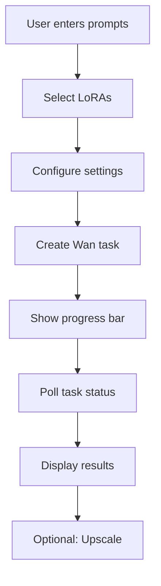

# 🎨 Image Generation Tool

> **Status**: ✅ Active | **Path**: `/tools/image-generation`

*Wan-local workflow for AI image generation with LoRA support*

---

## 📁 File Structure

```
src/tools/image-generation/
├── pages/
│   └── ImageGenerationToolPage.tsx    # Main UI orchestrator
├── components/
│   ├── ImageGenerationForm.tsx        # Generation settings form
│   ├── PromptGenerationControls.tsx   # Prompt management UI
│   ├── BulkEditControls.tsx          # Batch operations
└── settings.ts                       # Tool configuration
```

---

## 🔧 Key Components

### `ImageGenerationToolPage.tsx`
**Main orchestrator component**
- Manages Wan task creation via `useCreateTask`
- Displays real-time progress bar during generation
- Integrates `ImageGallery` with live updates
- Handles upscaling and deletion operations
- No environment-specific branching (Wan-only)
- **Gallery Filtering**: Supports media type (All/Images/Videos), shot filtering, position exclusion, and prompt search

### `ImageGenerationForm.tsx`
**Simplified generation form**
- **Inputs**: Prompts, images-per-prompt, before/after prompt text
- **Features**: Wan LoRA picker integration, collapsible form UI
- **Removed**: ControlNet sliders, starting-image inputs
- **State**: Persistent via `usePersistentToolState` (including form expand/collapse state)
- **UX**: Form can be collapsed to save space, state persisted per project
- **Sticky UI**: When collapsed, shows sticky button that attaches to top of screen while scrolling

### `PromptGenerationControls.tsx`
**AI-powered prompt management interface**
- **AI Generation**: Create prompts using Groq API (moonshotai/kimi-k2-instruct model)
- **Creativity Control**: 5-level temperature slider (0.4-1.2):
  - Predictable (0.4) - Consistent, expected results
  - Interesting (0.6) - Some variation with coherence
  - Balanced (0.8) - Good balance of creativity *(default)*
  - Chaotic (1.0) - Wild and unexpected ideas
  - Insane (1.2) - Maximum randomness
- **Bulk Operations**: AI-powered bulk editing of existing prompts
- **Context Awareness**: Include existing prompts as context for generation
- **Auto-summarization**: Generate short summaries for prompt organization
- **Persistence**: Settings saved per-project including temperature preference

---

## 🪝 Custom Hooks

### `useGenerations`
Provides generation management functionality:
```typescript
const {
  generations,      // List of generated images
  isLoading,       // Loading state
  upscale,         // Upscale image function
  deleteGeneration // Delete image function
} = useGenerations(projectId);
```

---

## 🤖 AI Service Integration

### Groq API (moonshotai/kimi-k2-instruct)
The tool integrates with Groq's API for AI-powered prompt generation:

**Edge Function**: `supabase/functions/ai-prompt/index.ts`
- Handles prompt generation, editing, and summarization
- Uses GROQ_API_KEY environment variable
- Supports dynamic temperature control (0.4-1.2)

**Service Hook**: `useAIInteractionService`
- Manages AI requests and state
- Provides `generatePrompts`, `editPromptWithAI`, `generateSummary`
- Handles loading states and error recovery

**Features**:
- **Generate**: Create multiple prompts based on user requirements
- **Edit**: AI-powered refinement of existing prompts  
- **Summarize**: Generate short descriptions for organization
- **Context**: Use existing prompts to inform new generations

---

## ⚙️ Settings Schema

```typescript
{
  id: 'image-generation',
  scope: ['project'],
  defaults: {
    prompts: [
      {
        id: 'prompt-1',
        fullPrompt: 'A majestic cat astronaut exploring a vibrant nebula, artstation',
        shortPrompt: 'Cat Astronaut',
      }
    ],
    imagesPerPrompt: 1,
    selectedLorasByMode: {
      'wan-local': [],
      'flux-api': [],
      'hidream-api': []
    },
    depthStrength: 50,
    softEdgeStrength: 20,
    generationMode: 'wan-local',
    beforeEachPromptText: '',
    afterEachPromptText: '',
    // AI Prompt Generation Settings
    temperature: 0.8,  // Creativity level (0.4-1.2)
    includeExistingContext: true,
    addSummary: true
  }
}
```

---

## 🔄 Generation Workflow



---

## 💡 Usage Tips

1. **LoRA Strength**: Start with 0.5-0.7 for best results
2. **Batch Size**: 4 images per prompt is optimal
3. **Prompts**: Use descriptive, specific language
4. **Before/After Text**: Apply consistent style modifiers

---

<div align="center">

**🔗 Related**

[Tool Settings](../data_persistence.md) • [Adding Tools](../adding_new_tool.md) • [Back to Structure](../structure.md)

</div> 