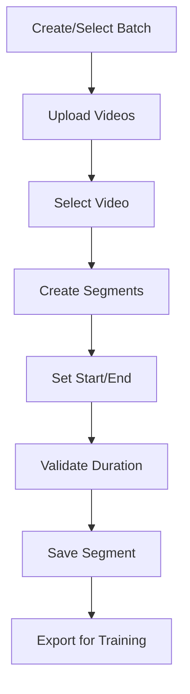

# 📹 Training Data Helper Tool

> **Status**: ⚠️ Hidden (Not Active) | **Path**: `/tools/training-data-helper`

*Organize, upload, and segment training videos for model fine-tuning*

---

## 📁 File Structure

```
src/tools/training-data-helper/
├── pages/
│   └── TrainingDataHelperPage.tsx    # Main UI
├── components/
│   ├── BatchSelector.tsx             # Batch management
│   ├── VideoUploadList.tsx           # Video grid display
│   ├── MultiVideoUploader.tsx        # Bulk upload
│   ├── VideoSegmentEditor.tsx        # Advanced editor
│   └── Timeline.tsx                  # Shared timeline
├── hooks/
│   └── useTrainingData.ts           # Data operations
└── settings.ts                      # Tool configuration
```

---

## 🔧 Key Components

### `TrainingDataHelperPage.tsx`
**Main orchestrator**
- Batch selection and management
- Video upload to Supabase storage
- Video selection interface
- Segment creation/management
- Direct access: `/tools/training-data-helper`

### `BatchSelector.tsx`
**Batch management interface**
- Create new batches
- Select existing batches
- Inline name editing
- Relative time display
- Delete with confirmation

### `VideoUploadList.tsx`
**Video grid display**
- Thumbnail previews
- Video metadata display
- Selection checkboxes
- Deletion functionality
- Error handling (400 errors via `markVideoAsInvalid()`)

### `MultiVideoUploader.tsx`
**Bulk upload component**
- Multiple file selection
- Upload progress tracking
- Error handling per file
- Queue management
- Retry failed uploads

### `VideoSegmentEditor.tsx`
**Advanced video editing interface**

#### Features:
- **Frame-accurate navigation**
- **Smart marker reordering** (chronological adjustment)
- **Custom timeline with zoom**
- **Playback speed control**
- **Segment validation**

#### Keyboard Shortcuts:
| Key | Action |
|-----|--------|
| `Space` | Play/Pause |
| `←/→` | Frame step |
| `Shift+←/→` | 10-frame jump |
| `[/]` | Set segment start/end |
| `Delete` | Remove segment |
| `1-9` | Playback speed |

#### Controls:
- Custom timeline visualization
- Floating-point tolerance
- Preview with validation
- Tooltips for all actions
- Error boundary protection

---

## 🪝 Custom Hook

### `useTrainingData`
Comprehensive data management:

```typescript
const {
  // Batch operations
  batches,
  createBatch,
  updateBatch,
  deleteBatch,
  
  // Video operations  
  videos,
  uploadVideo,
  deleteVideo,
  getVideoUrl,
  
  // Segment operations
  segments,
  createSegment,
  updateSegment,
  deleteSegment,
  
  // Loading states
  isLoading,
  error
} = useTrainingData();
```

---

## ⚙️ Settings Schema

```typescript
{
  id: 'training-data-helper',
  scope: ['user'],
  defaults: {
    autoPlay: true,
    defaultSegmentDuration: 5,
    showTimestamps: true,
    gridView: 'thumbnails'
  }
}
```

---

## 🔄 Workflow



---

## 💡 Best Practices

1. **Batch Organization**: Group related videos by style/subject
2. **Segment Length**: 3-10 seconds optimal for most models
3. **Frame Accuracy**: Use keyboard shortcuts for precision
4. **Validation**: Check segment boundaries before saving
5. **Storage**: Videos stored in `training-data` bucket with RLS

---

## ⚠️ Activation Steps

To enable this tool:

1. Set environment flag for visibility
2. Ensure storage bucket policies are configured
3. Test video upload limits
4. Verify segment export format

---

<div align="center">

**🔗 Related Documentation**

[Storage Buckets](../structure.md#database--storage-overview) • [Back to Structure](../structure.md)

</div> 