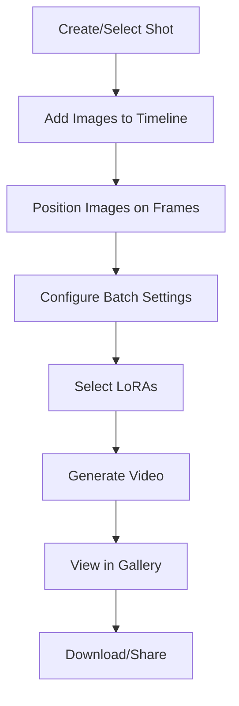

# 🎬 Video Travel Tool

> **Status**: ✅ Active | **Path**: `/tools/travel-between-images`

*Frame-accurate video generation with timeline-based shot editing*

---

## 📁 File Structure

```
src/tools/travel-between-images/
├── pages/
│   └── VideoTravelToolPage.tsx        # Main tool UI
├── components/
│   ├── ShotEditor.tsx                 # Core editing environment
│   ├── Timeline/                      # Frame-accurate timeline (refactored)
│   │   ├── index.tsx                  # Main Timeline component
│   │   ├── TimelineItem.tsx           # Individual timeline items
│   │   ├── TimelineControls.tsx       # Zoom & context controls
│   │   ├── TimelineRuler.tsx          # Frame ruler display
│   │   ├── DropIndicator.tsx          # File drop visual feedback
│   │   ├── PairRegion.tsx             # Video pair visualization
│   │   ├── hooks/
│   │   │   ├── useFileDrop.ts         # File drag/drop logic
│   │   │   ├── useFramePositions.ts   # Frame position management
│   │   │   ├── useTimelineDrag.ts     # Timeline drag interactions
│   │   │   └── useZoom.ts             # Zoom & pan functionality
│   │   └── utils/
│   │       └── timeline-utils.ts      # Timeline calculations
│   ├── BatchSettingsForm.tsx          # Video generation settings
│   ├── VideoOutputsGallery.tsx        # Generated video display
│   ├── SimpleVideoPlayer.tsx          # Lightweight player
│   ├── TaskDetailsModal.tsx           # Generation parameters (dialog wrapper)
│   ├── TaskDetailsContent.tsx         # Task details content component
│   ├── VideoShotDisplay.tsx           # Shot preview card
│   ├── ShotListDisplay.tsx            # Shot grid view with drag-and-drop reordering
│   ├── SortableShotItem.tsx           # Draggable shot card wrapper
│   └── SortableImageItem.tsx          # Draggable images
└── settings.ts                        # Tool configuration
```

---

## 🔧 Key Components

### `VideoTravelToolPage.tsx`
**Main tool interface**
- Lists project shots with `ShotListDisplay`
- Creates new shots via Supabase
- Hosts the main `ShotEditor`
- Manages LoRA state filtering for "Wan 2.1 14b" models
- Handles shot selection and navigation

### `ShotListDisplay.tsx` & `SortableShotItem.tsx`
**Shot reordering system with progressive loading**
- **Drag-and-Drop Interface**: Shots can be reordered by dragging the grip handle (⋮⋮)
- **Integrated Button Design**: Grip handle appears as the first action button, styled consistently
- **Database Integration**: Auto-saves new order using position field with `useReorderShots` hook
- **Optimistic Updates**: Immediate visual feedback with no jumping, reverts only on error
- **Visual Feedback**: Dragged items become semi-transparent, disabling during save operations
- **Touch Support**: Configured for mobile with delay/tolerance for drag activation
- **Error Handling**: Toast notifications for failed reorder operations

**Progressive Loading Performance**
- **Priority Batching**: First 3 shots load immediately, then batches of 3 every 500ms
- **Browser Cache Detection**: `checkIfImageCached()` detects images already loaded in ShotsPane
- **Smart Loading**: Cached images appear instantly, bypassing priority queue
- **Loading States**: Skeleton animations with spinning indicators during image loading
- **Staggered Animations**: Images reveal with 0.1s delays for smooth visual progression

### `ShotEditor.tsx`
**Core editing environment**
- Positions `VideoOutputsGallery` above for visibility
- Orchestrates all editing components
- Includes LoRA selector with strength controls
- Validates OpenAI API key when *Enhance Prompt* enabled
- Offers "Crop to project size" helper
- Manages shot state and updates

### `Timeline/` (Modular Timeline System)
**Frame-accurate timeline component (refactored into modular architecture)**
- **Main Component** (`index.tsx`):
  - Orchestrates all timeline functionality
  - Integrates drag/drop, zoom, and positioning logic
  - Manages frame validation and constraints
- **Sub-Components**:
  - `TimelineItem.tsx`: Individual draggable image items with visual feedback
  - `TimelineControls.tsx`: Context frames slider & zoom controls
  - `TimelineRuler.tsx`: Frame number ruler display
  - `DropIndicator.tsx`: Visual feedback for file drop targeting
  - `PairRegion.tsx`: Video pair visualization with context frames
- **Custom Hooks**:
  - `useFileDrop.ts`: File drag/drop validation and positioning
  - `useFramePositions.ts`: Frame position state management
  - `useTimelineDrag.ts`: Complex drag interactions with modifier key support
  - `useZoom.ts`: Zoom and pan functionality
- **Utilities**: `timeline-utils.ts` for frame calculations and constraints
- **Features**:
  - Drag-and-drop image positioning with modifier key support (⌘/⌥)
  - External image file dropping with frame-specific positioning
  - Gap validation between frames with visual feedback
  - Zoomable ruler overlay with pan support
  - `MediaLightbox` preview on click
  - Persistent position storage
- **File Support**: JPEG, PNG, WebP images via drag and drop
- **Drop Targeting**: Visual indicator shows exact frame position during drag
- **Precision**: Frame-level accuracy for video timing

### `BatchSettingsForm.tsx`
**Video generation settings**
- **Inputs**:
  - Batch prompts
  - Frame count & duration
  - Generation parameters
- **Features**:
  - *Enhance prompt* checkbox (requires OpenAI)
  - Mutually-exclusive LoRA toggles
  - Settings validation

### `VideoOutputsGallery.tsx`
**Generated video display**
- 3-column responsive grid
- Pagination for large collections
- Lightbox preview on click
- Download & delete actions
- Real-time update integration

### `SimpleVideoPlayer.tsx`
**Video playback controls**
- Speed options: -2×, -1×, 1×, 2×
- Lightweight player implementation
- Replaces hover-scrub in lightbox
- Frame-by-frame navigation

### `TaskDetailsModal.tsx`
**Generation parameter viewer (dialog wrapper)**
- Shows complete generation settings in a modal dialog
- *Use These Settings* button
- Applies parameters to `BatchSettingsForm`
- Deduplicates prompts automatically

### `TaskDetailsContent.tsx`
**Task details content component (reusable)**
- Embeddable task details component without dialog wrapper
- Used in MediaLightbox for side-by-side video + task details layout
- Shows input images, prompts, technical settings (steps, resolution, frames, context)
- Compact mobile-friendly layout with collapsible sections
- Supports both standalone usage and integration in larger UI components
- Expands array parameters

---

## 🔄 Video Generation Workflow



---

## ⚙️ Settings Schema

```typescript
{
  id: 'travel-between-images',
  scope: ['project', 'shot'],
  defaults: {
    framesPerVideo: 30,
    fps: 10,
    enhancePrompt: false,
    selectedLoRAs: [],
    batchSize: 1,
    interpolationSteps: 4
  }
}
```

---

## 🎯 Timeline Features

### Image Positioning
- Drag images to specific frames
- Automatic gap detection
- Visual feedback for invalid positions
- Snap-to-frame functionality

### Zoom & Navigation
- Mouse wheel zoom
- Pan with drag
- Frame ruler with labels
- Current position indicator

---

## 💡 Pro Tips

1. **Frame Spacing**: Leave 3-5 frames between images for smooth transitions
2. **LoRA Selection**: Use causvid for motion, LightI2X for style
3. **Prompt Enhancement**: Enable for more creative variations
4. **Batch Size**: Start with 1-2 videos to test settings

---

## Implementation Details

### Navigation & State Management

The Video Travel tool uses a universal navigation pattern via `useShotNavigation()`:

```typescript
const { navigateToShot, navigateToNextShot, navigateToPreviousShot } = useShotNavigation();

// Previous/Next buttons in ShotEditor
const handleNextShot = () => {
  if (shots && selectedShot) {
    navigateToNextShot(shots, selectedShot);
  }
};
```

**URL Hash Synchronization**: The tool maintains shot selection via URL hash (`#shotId`) with automatic synchronization between:
- URL changes (browser back/forward, direct links)
- Programmatic navigation (Previous/Next buttons)
- Shot selection from other components (ShotsPane, ShotGroup)

### Scalability Optimizations

**Client-Side Batch Fetching**: Handles projects with 1000+ generations by fetching `shot_generations` in batches:
```typescript
// useListShots implements batching for large datasets
const BATCH_SIZE = 1000;
while (hasMore) {
  const batch = await supabase
    .from('shot_generations')
    .select('*, generation:generations(*)')
    .range(offset, offset + BATCH_SIZE - 1);
  // Concatenate and continue...
}
```

**Database Optimizations**:
- `count_unpositioned_generations()` SQL function for efficient counts
- Performance indexes on `shot_id`, `position`, and `created_at`
- Client-side sorting instead of database ordering for flexibility

**Optimistic Updates**: ShotEditor uses optimistic state updates with conflict resolution to prevent UI flickering during reordering and editing operations.

---

<div align="center">

**🔗 Related Documentation**

[Back to Structure](../structure.md)

</div> 