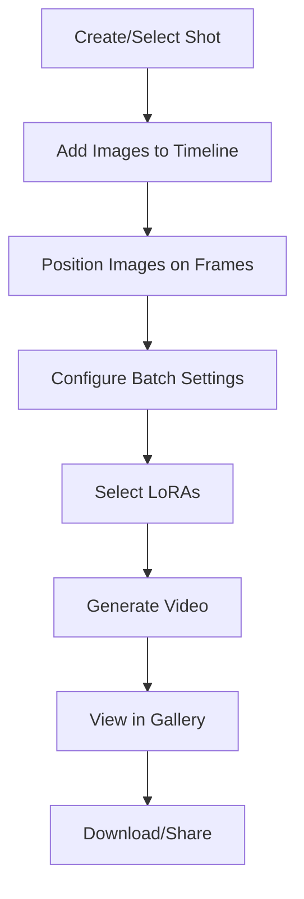

# 🎬 Video Travel Tool

> **Status**: ✅ Active | **Path**: `/tools/travel-between-images`

*Frame-accurate video generation with timeline-based shot editing*

---

## 📁 File Structure

```
src/tools/travel-between-images/
├── pages/
│   └── VideoTravelToolPage.tsx        # Main tool UI
├── components/
│   ├── ShotEditor.tsx                 # Core editing environment
│   ├── Timeline.tsx                   # Frame-accurate timeline
│   ├── BatchSettingsForm.tsx          # Video generation settings
│   ├── VideoOutputsGallery.tsx        # Generated video display
│   ├── SimpleVideoPlayer.tsx          # Lightweight player
│   ├── TaskDetailsModal.tsx           # Generation parameters
│   ├── VideoShotDisplay.tsx           # Shot preview card
│   ├── ShotListDisplay.tsx            # Shot grid view
│   ├── SortableImageItem.tsx          # Draggable images
│   └── CreateShotModal.tsx            # New shot dialog
└── settings.ts                        # Tool configuration
```

---

## 🔧 Key Components

### `VideoTravelToolPage.tsx`
**Main tool interface**
- Lists project shots with `ShotListDisplay`
- Creates new shots via Supabase
- Hosts the main `ShotEditor`
- Manages LoRA state filtering for "Wan 2.1 14b" models
- Handles shot selection and navigation

### `ShotEditor.tsx`
**Core editing environment**
- Positions `VideoOutputsGallery` above for visibility
- Orchestrates all editing components
- Includes LoRA selector with strength controls
- Validates OpenAI API key when *Enhance Prompt* enabled
- Offers "Crop to project size" helper
- Manages shot state and updates

### `Timeline.tsx`
**Frame-accurate timeline component**
- **Features**:
  - Drag-and-drop image positioning
  - Gap validation between frames
  - Zoomable ruler overlay
  - `MediaLightbox` preview on click
  - Persistent position storage
- **Precision**: Frame-level accuracy for video timing

### `BatchSettingsForm.tsx`
**Video generation settings**
- **Inputs**:
  - Batch prompts
  - Frame count & duration
  - Generation parameters
- **Features**:
  - *Enhance prompt* checkbox (requires OpenAI)
  - Mutually-exclusive LoRA toggles
  - Settings validation

### `VideoOutputsGallery.tsx`
**Generated video display**
- 3-column responsive grid
- Pagination for large collections
- Lightbox preview on click
- Download & delete actions
- Real-time update integration

### `SimpleVideoPlayer.tsx`
**Video playback controls**
- Speed options: -2×, -1×, 1×, 2×
- Lightweight player implementation
- Replaces hover-scrub in lightbox
- Frame-by-frame navigation

### `TaskDetailsModal.tsx`
**Generation parameter viewer**
- Shows complete generation settings
- *Use These Settings* button
- Applies parameters to `BatchSettingsForm`
- Deduplicates prompts automatically
- Expands array parameters

---

## 🔄 Video Generation Workflow



---

## ⚙️ Settings Schema

```typescript
{
  id: 'travel-between-images',
  scope: ['project', 'shot'],
  defaults: {
    framesPerVideo: 30,
    fps: 10,
    enhancePrompt: false,
    selectedLoRAs: [],
    batchSize: 1,
    interpolationSteps: 4
  }
}
```

---

## 🎯 Timeline Features

### Image Positioning
- Drag images to specific frames
- Automatic gap detection
- Visual feedback for invalid positions
- Snap-to-frame functionality

### Zoom & Navigation
- Mouse wheel zoom
- Pan with drag
- Frame ruler with labels
- Current position indicator

---

## 💡 Pro Tips

1. **Frame Spacing**: Leave 3-5 frames between images for smooth transitions
2. **LoRA Selection**: Use causvid for motion, LightI2X for style
3. **Prompt Enhancement**: Enable for more creative variations
4. **Batch Size**: Start with 1-2 videos to test settings

---

<div align="center">

**🔗 Related Documentation**

[Timeline Guide](../timeline.md) • [LoRA Usage](../lora-guide.md) • [Back to Structure](../structure.md)

</div> 