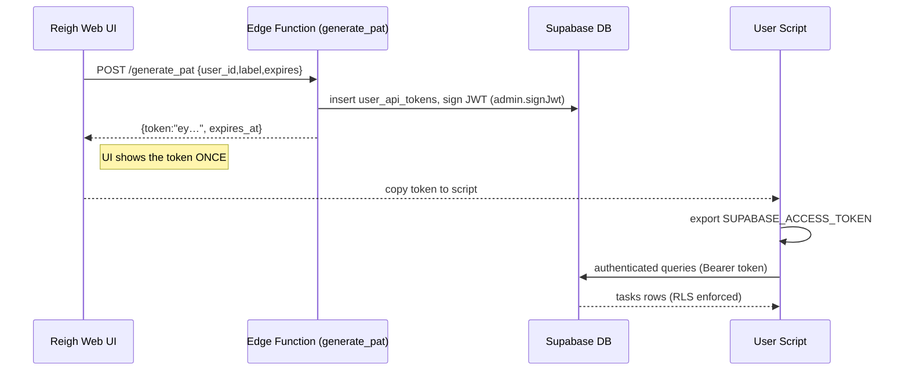

# Personal API Tokens for Local Task Processing

> **Status:** Proposal _(v0.1 – seek feedback)_

Reigh needs a way to let advanced users run **local worker scripts** that poll the `tasks` table, process work (image generation, video travel, etc.) and push updates **without exposing elevated privileges**.  This document surveys the options and recommends a practical implementation using Supabase-signed JWTs that impersonate the user.

---

## 1. Goals & Constraints

1. Users must be able to **read & update only their own rows** according to existing Row-Level-Security (RLS) policies (see `structure.md`).
2. Tokens should be **easy to pass to a headless script** (e.g. `SUPABASE_ACCESS_TOKEN=… node worker.js`).
3. Revocation and rotation should be possible without resetting the user’s normal login.
4. We must **avoid shipping the Service-Role key** or any credential that bypasses RLS.
5. Solution should work even when the user is **offline from Reigh’s web UI** (no interactive login flow).

## 2. Recap: How Supabase Auth Works

* Every session in Supabase is represented by a **JWT** ("access token") that contains claims such as `sub` (user id) and `role` (`authenticated`).
* When the client calls the **PostgREST endpoint** or an **Edge Function**, the JWT is forwarded in the `Authorization: Bearer <token>` header.
* Inside Postgres, **RLS policies** read those JWT claims via `auth.jwt()` ensuring each query complies with the security rules.

Therefore, **if we can hand-craft a valid JWT for a user, that token will inherit all existing RLS guarantees** – no additional database changes required.

## 3. Options Considered

| # | Approach | Pros | Cons |
|---|----------|------|------|
| A | **Service-Role Key** | Simple; limitless | Bypasses RLS → user could read everyone’s data. Unacceptable. |
| B | **Interactive sign-in every run** (email/password, magic link, PKCE) | Native Supabase flow; short-lived tokens | Not script-friendly; can’t run unattended; refresh-token persistence adds complexity. |
| C | **Custom API key table + Postgres `SET` role** | Full control (scopes, expiry) | Heavy DB plumbing; requires per-request `SET` or SECURITY DEFINER functions; re-implements what Jwt already gives us. |
| **D** | **Admin-signed long-lived JWT (⟵ Recommended)** | Honors RLS; one string env var; fast to build; revocable; leverages existing Supabase helpers | Needs small helper to (re)issue & revoke tokens; very long expiry tokens carry higher theft risk (mitigated via revocation list). |

## 4. Recommended Design (Option D)

1. **Generate** a long-lived JWT for the user via the Admin SDK:

   ```ts
   // scripts/generateUserPat.ts
   import { createClient } from "@supabase/supabase-js";

   const supabaseAdmin = createClient(
     process.env.NEXT_PUBLIC_SUPABASE_URL!,
     process.env.SUPABASE_SERVICE_ROLE_KEY!
   );

   const token = await supabaseAdmin.auth.admin.signJwt({
     sub: userId,          // required – user to impersonate
     role: "authenticated",
     iat: Math.floor(Date.now() / 1000),
     exp: Math.floor(Date.now() / 1000) + 60 * 60 * 24 * 365, // 1 year
   });
   console.log(token);
   ```

2. **Store a hash** of the JWT’s `jti` (JWT ID) in a new table `user_api_tokens` so we can revoke later:

   ```sql
   create table public.user_api_tokens (
     id          uuid primary key default gen_random_uuid(),
     user_id     uuid references auth.users on delete cascade,
     jti_hash    text not null,
     label       text,           -- e.g. "Home workstation"
     created_at  timestamptz default now(),
     expires_at  timestamptz null
   );
   ```

3. **Edge Function middleware** (`verify_api_token.ts`) or Postgres RLS extension checks that the `jti` is **not revoked**.  If it is revoked, return 401.

4. Deliver the **plain JWT once** to the user via the web UI (**Settings → App Settings → API Tokens**).  From there they can copy-paste it into their local environment.  For example:

   ```bash
   SUPABASE_URL="https://xyz.supabase.co"
   SUPABASE_ACCESS_TOKEN="eyJhbGciOiJ…"
   ```

   and in their script:

   ```ts
   import { createClient } from "@supabase/supabase-js";
   const client = createClient(process.env.SUPABASE_URL!, process.env.SUPABASE_ACCESS_TOKEN!);
   ```

5. **RLS remains untouched** – tasks are filtered by `project_id` → `projects.user_id = auth.uid()`, so the script only sees its owner’s rows.  Attempts to `insert` new tasks will fail (policy already requires `service_role`).

### Python example (headless script)

```python
# worker.py – runs fully independent of the React app
import os, asyncio
from supabase import create_client, Client  # `pip install supabase`

url: str = os.environ["SUPABASE_URL"]
token: str = os.environ["SUPABASE_ACCESS_TOKEN"]

supabase: Client = create_client(url, token)

async def main():
    # fetch queued tasks for this user
    tasks = (
        supabase
        .table("tasks")
        .select("*")
        .eq("status", "Queued")
        .execute()
    ).data
    for t in tasks:
        print("Processing", t["id"])
        # ... do work ...
        supabase.table("tasks").update({"status": "Complete"}).eq("id", t["id"]).execute()

if __name__ == "__main__":
    asyncio.run(main())
```

The script never contacts the Reigh web app – it talks straight to Supabase REST/Realtime using the user-scoped token.

## 5. Token Lifecycle Flow



## 6. Implementation Checklist

- [ ] Edge Function `generate_pat`
  - Authenticated via `service_role` only (callable from admin UI)
  - Creates DB entry + signs JWT
- [ ] UI panel under **Settings → App Settings → API Tokens**
  - List active tokens (label, last used, expires)
  - Button **Generate New Token** (calls function)
  - Revoke (delete row) – instantly invalid via revocation middleware
- [ ] `user_api_tokens` table + policy: only owner can read; no one can write except Edge Function (service role)
- [ ] Middleware to check `jti_hash` on every request (can be Pg function loaded in `postgrest_pre_request`)
- [ ] Docs / CLI sample for users (add to README)

## 7. Security Considerations

1. **Least privilege** – token role is still `authenticated`, so user cannot bypass RLS.
2. **Expiry** – set sensible maximum (e.g. 90 days) and require regeneration.
3. **Hash at rest** – store only a salted SHA-256 of `jti` so DB leak ≠ token leak.
4. **Transport** – deliver token over HTTPS only; show once.
5. **Revocation** – deleting the `user_api_tokens` row immediately invalidates the token on next request.

## 8. Alternatives & Future Work

* Use Supabase’s upcoming **Personal Access Token** feature (if/when exposed to projects) to avoid custom table.
* Support **scopes** by embedding custom claims (e.g. `scopes:["tasks.read","tasks.update"]`) and reflecting that in RLS.
* Auto-refreshing short-lived JWT via signed refresh token (more churn, less risk).

---

### TL;DR
Issue a **long-lived JWT signed with the Service-Role key that impersonates the user**.  Store its `jti` hashed for revocation.  Users set it as `SUPABASE_ACCESS_TOKEN` in their local worker scripts and all RLS policies continue to protect data boundaries with zero additional query logic. 