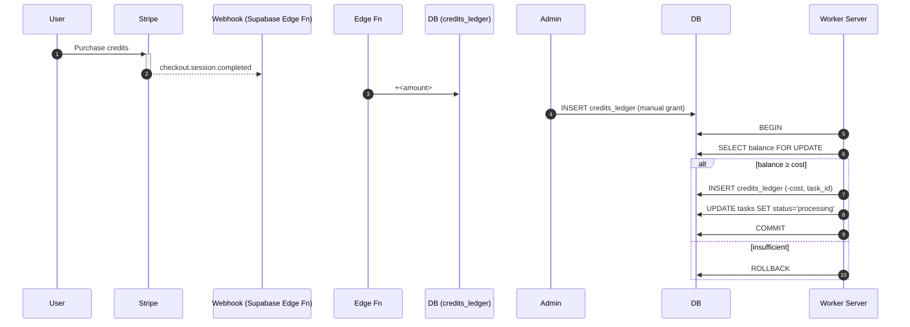

# Credit-Based Task Processing System

_Design document – draft v1_

## 1  Motivation
Our platform needs to meter computationally expensive tasks (e.g. image generation, video travel) against a **credit balance** that customers can top-up via Stripe or through manual grants.  A task should only transition from **`Start` → `Processing`** when sufficient credits are available; otherwise it remains queued.

Key requirements:
1. Purchasable credits (Stripe Checkout / Customer Portal).
2. Admin-granted or promotional credits.
3. Atomic, server-side deduction when a worker starts a task.
4. Protection against double-spending and race conditions.
5. Transparent ledger for auditing / refunds.

## 2  High-Level Flow


## 3  Data Model (Drizzle)
```ts
// accounts table (one per customer/org)
accounts = pgTable('accounts', {
  id: uuid().primaryKey(),
  userId: uuid().notNull(),   // owner
  // cached running total – keeps balance() calculation cheap
  credits: integer().default(0).notNull(),
  createdAt: timestamp().defaultNow(),
});

creditsLedger = pgTable('credits_ledger', {
  id: uuid().primaryKey(),
  accountId: uuid().references(() => accounts.id).notNull(),
  taskId: uuid(),                 // nullable for top-ups
  amount: integer().notNull(),    // positive = top-up, negative = spend
  type: varchar().notNull(),      // 'stripe' | 'manual' | 'spend'
  metadata: jsonb(),
  createdAt: timestamp().defaultNow(),
});
```
**Balance** = `sum(amount)` for an account.  We maintain a cached `accounts.credits` via triggers for quick checks.

### DB Trigger (Postgres / Supabase)
```sql
CREATE FUNCTION refresh_account_balance() RETURNS trigger LANGUAGE plpgsql AS $$
BEGIN
  UPDATE accounts SET credits = (
    SELECT COALESCE(SUM(amount),0) FROM credits_ledger WHERE account_id = NEW.account_id
  ) WHERE id = NEW.account_id;
  RETURN NEW;
END;
$$;

CREATE TRIGGER credits_ledger_after_ins
AFTER INSERT ON credits_ledger
FOR EACH ROW EXECUTE FUNCTION refresh_account_balance();
```
The same trigger can be reused for updates/deletes if ever needed.

## 4  Adding Credits
### 4.1  Stripe Integration
1. Client initiates checkout/session for a credit package (e.g. 1 000 credits).
2. Stripe Checkout → redirects to success URL.
3. **Supabase Edge Function** (`/functions/stripe-webhook`) listens for `checkout.session.completed` + `invoice.paid` events.
4. On event, insert positive ledger row (`type='stripe'`) inside a **single call** – no client involvement.

Security: Verify Stripe signature; lookup account via `customer` metadata.

### 4.2  Manual Grants
* Admin dashboard or SQL console inserts a row with `type='manual'`.
* Could be exposed via an internal REST endpoint protected by service role key.

## 5  Consuming Credits (Worker Server)
The worker that dequeues tasks is **the single authority** for deduction.

```ts
await db.transaction(async (tx) => {
  const acct = await tx.query.accounts.findFirst({
    where: eq(accounts.id, accountId),
    locking: { strength: 'update' }, // FOR UPDATE
  });
  const cost = estimateCost(task); // deterministic function
  if ((acct?.credits ?? 0) < cost) throw new InsufficientCreditsError();

  await tx.insert(creditsLedger).values({
    accountId, taskId: task.id, amount: -cost, type: 'spend',
  });
  await tx.update(tasks).set({ status: 'processing' }).where(eq(tasks.id, task.id));
});
```
The `FOR UPDATE` lock guarantees two workers cannot deduct simultaneously.

### Retry / Failure Handling
* If the worker crashes **after** deducting but **before** completing the task, refund strategy:
  * a scheduled job scans `tasks` stuck in `processing` beyond N minutes → refunds ledger (+cost, type='refund').

## 6  API Surface (App → Server)
The React app does **not** deduct credits directly.  It needs only:
* `GET /api/credits/balance` → shows remaining credits.
* `GET /api/credits/ledger?limit=100` → for history UI.
* `POST /api/credits/checkout { packageId }` → returns Stripe Checkout URL.
Admin-only:
* `POST /api/credits/grant { accountId, amount, reason }`.

## 7  Security & RLS
* All ledger operations use service-role key or run inside Edge Functions.
* Client selects only from a view `v_user_ledger` filtered by `auth.uid()`.
* No client can directly insert/update ledger rows.

## 8  Estimating Task Cost
`estimateCost(task)` can depend on:
* tool (`image-generation`, `video-travel`, …)
* resolution, frame count, model type
The mapping lives inside the worker repo so it evolves alongside algorithms.

## 9  Implementation Plan
1. **DB Migration** – create `accounts`, `credits_ledger`, trigger.
2. **Stripe Products** – define credit SKUs; store Stripe `price_id` ↔ credit amount mapping.
3. **Edge Function** – Stripe webhook inserts ledger row.
4. **Worker Update** – wrap dequeue logic in transactional deduction.
5. **REST Layer** – expose balance & ledger endpoints for UI.
6. **React UI** –
   * Show remaining credits in header.
   * Checkout dialog.
   * Ledger history table.
7. **Monitoring** – add Prometheus metric `credits_balance{account}` and alert on low credits.

## 10  Open Questions
* Multi-tenant accounts vs per-user balances?
* Grace credits (allow negative up to ‑X)?
* Volume discounts / subscription tiers (combine recurring seats + pay-as-you-go credits)?
* Regional pricing for costly resources (GPU hours).

---
_© Reigh Architects, 2025_ 